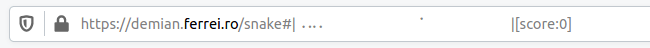

# Basic Snake Game - Dockerized and AKS-Ready

A simple, classic snake game built using HTML, CSS, and JavaScript, containerized with Docker using an Nginx base image and deployable to Azure Kubernetes Service (AKS).

---

## 🕹️ Features

- Interactive snake game playable in a web browser.
- Simple design with a focus on gameplay.
- Lightweight and optimized for containerized deployment.

---

## 🛠️ Technologies Used

- **Frontend:**
  - HTML5, CSS3, JavaScript
- **Containerization:**
  - Docker with Nginx Image
- **Orchestration:**
  - Kubernetes (AKS)

---

## 🚀 How to Run Locally

### Prerequisites

- Docker
- Kubernetes CLI (`kubectl`) for AKS deployment
- Azure CLI (for AKS management)

---

### Steps to Run

#### 1. Clone the Repository

`git clone https://github.com/surajkk93/snake.game.git`

`cd basic-snake-game`

2. Run with Docker

Build the Docker Image

`docker build -t basic-snake-game .`

Run the Container

`docker run -p 8080:80 basic-snake-game`

Access the game at http://localhost:8080.

---

🚢 Deploy to AKS

Prerequisites

A configured AKS cluster.

kubectl installed and connected to your AKS cluster.

Steps

1. Create a Deployment

Use the provided deployment.yml file to deploy the application to AKS:

`kubectl apply -f deployment.yml`

2. Expose the Application

If the deployment.yml includes a Service definition, the application will be exposed via the LoadBalancer. Use the EXTERNAL-IP from the following command to access the game:

`kubectl get service`

Access the game at http://EXTERNAL-IP.

# Play Game using URL

Play the classic snake game on a URL!

<https://demian.ferrei.ro/snake>

# Note:
- You will see question mark click on it 

- The game might be unplayable on some browsers for different reasons, like the browser not showing the full URL, or not allowing it to change so frequently, or escaping the Braille characters used to display the game.

----

🖼️ Screenshots

